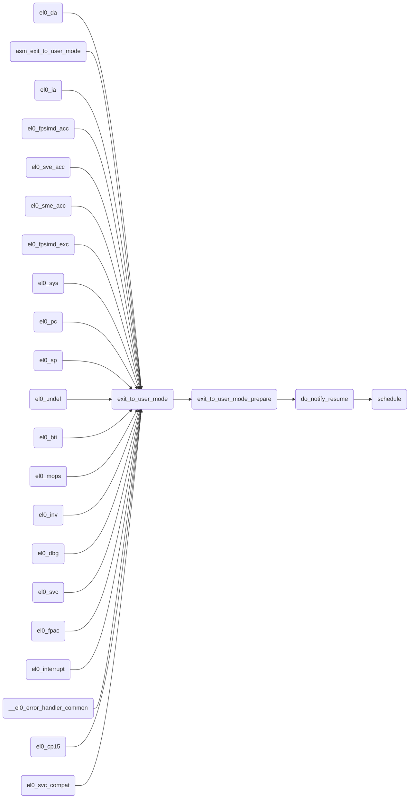
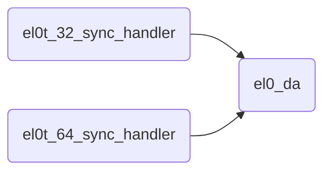

[TOC]

# 调度点

## 返回用户态

- 代码基线Linux 6.12-rc3
- 代码位于```arch/arm64/kernel/entry-common.c```文件中：


```mermaid
graph LR
A(el0_da) --> B(exit_to_user_mode) --> C(exit_to_user_mode_prepare) --> D(do_notify_resume) --> E(schedule)
F(asm_exit_to_user_mode) --> B(exit_to_user_mode)
el0_ia(el0_ia) --> B(exit_to_user_mode)
el0_fpsimd_acc(el0_fpsimd_acc) --> B(exit_to_user_mode)
el0_sve_acc(el0_sve_acc) --> B(exit_to_user_mode)
el0_sme_acc(el0_sme_acc) --> B(exit_to_user_mode)
el0_fpsimd_exc(el0_fpsimd_exc) --> B(exit_to_user_mode)
el0_sys(el0_sys) --> B(exit_to_user_mode)
el0_pc(el0_pc) --> B(exit_to_user_mode)
el0_sp(el0_sp) --> B(exit_to_user_mode)
el0_undef(el0_undef) --> B(exit_to_user_mode)
el0_bti(el0_bti) --> B(exit_to_user_mode)
el0_mops(el0_mops) --> B
el0_inv(el0_inv) --> B
el0_dbg(el0_dbg) --> B
el0_svc(el0_svc) --> B
el0_fpac(el0_fpac) --> B
el0_interrupt(el0_interrupt) --> B
__el0_error_handler_common(__el0_error_handler_common) --> B
el0_cp15(el0_cp15) --> B
el0_svc_compat(el0_svc_compat) --> B
```

返回用户态，说明首先就是从用户态进入内核态，那么用户态怎么进入内核态呢？

### el0_da


```mermaid
graph LR
el0t_32_sync_handler(el0t_32_sync_handler) --> el0_da(el0_da)
el0t_64_sync_handler(el0t_64_sync_handler) --> el0_da
```

要理解这段代码，首先要搞懂el0t的概念。
