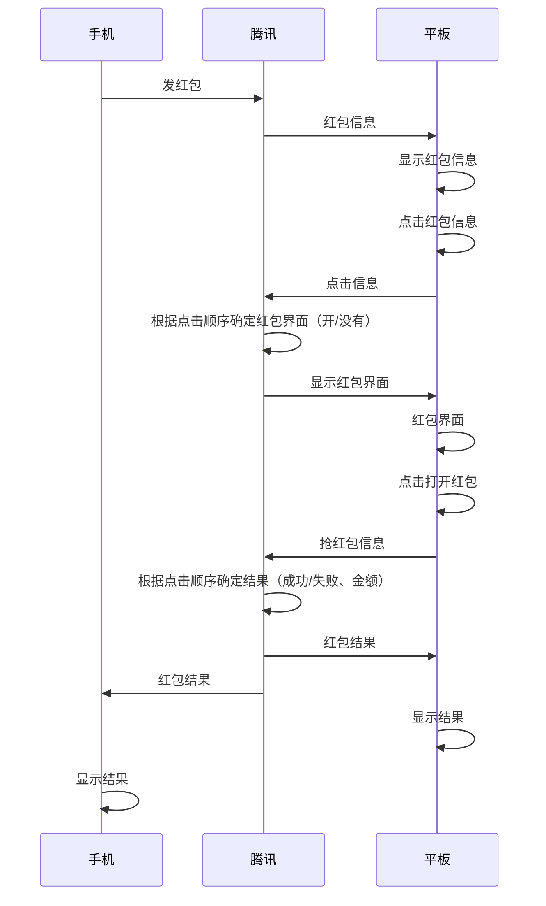
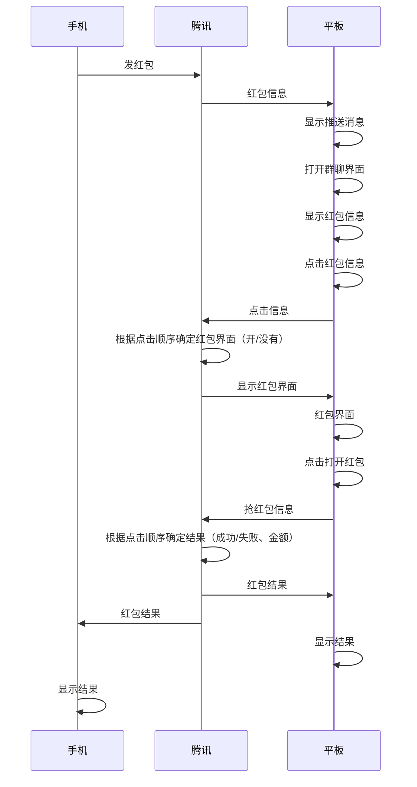

[TOC]

# 微信抢红包时序图
## 群聊界面

```mermaid
sequenceDiagram
participant 手机
手机->> 腾讯: 发红包
腾讯->> 平板: 红包信息
平板->> 平板: 显示红包信息
平板->> 平板: 点击红包信息
平板->> 腾讯: 点击信息
腾讯->> 腾讯: 根据点击顺序确定红包界面（开/没有）
腾讯->> 平板: 显示红包界面
平板->> 平板: 红包界面
平板->> 平板: 点击打开红包
平板->> 腾讯: 抢红包信息
腾讯->> 腾讯: 根据点击顺序确定结果（成功/失败、金额）
腾讯->> 平板: 红包结果
腾讯->> 手机: 红包结果
平板->> 平板: 显示结果
手机->> 手机: 显示结果
```

## 微信主界面

```mermaid
sequenceDiagram
participant 手机
手机->> 腾讯: 发红包
腾讯->> 平板: 红包信息
平板->> 平板: 显示推送消息
平板->> 平板: 打开群聊界面
平板->> 平板: 显示红包信息
平板->> 平板: 点击红包信息
平板->> 腾讯: 点击信息
腾讯->> 腾讯: 根据点击顺序确定红包界面（开/没有）
腾讯->> 平板: 显示红包界面
平板->> 平板: 红包界面
平板->> 平板: 点击打开红包
平板->> 腾讯: 抢红包信息
腾讯->> 腾讯: 根据点击顺序确定结果（成功/失败、金额）
腾讯->> 平板: 红包结果
腾讯->> 手机: 红包结果
平板->> 平板: 显示结果
手机->> 手机: 显示结果
```