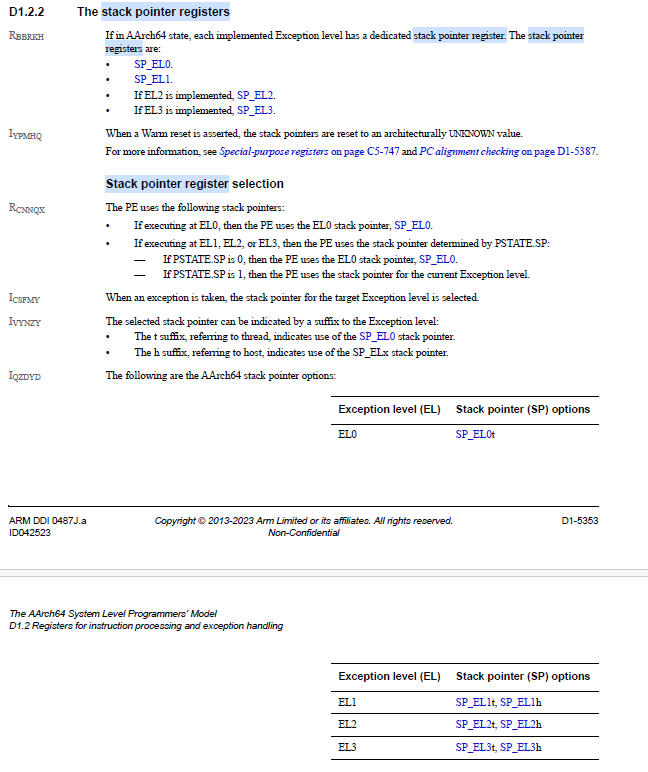

[TOC]

# 栈寄存器选择

- 代码基线Linux 6.12-rc3
- 代码位于```arch/arm64/kernel/entry.S```文件中：

## 异常向量表

我们都知道，ARM64的体系结构中，无论是系统调用，还是中断IRQ，都是通过异常机制实现的，而异常仅仅提供了一个入口，这就是异常向量表，arm64的异常向量表就定义在```arch/arm64/kernel/entry.S```文件中:
```
SYM_CODE_START(vectors)
	kernel_ventry	1, t, 64, sync		// Synchronous EL1t
	kernel_ventry	1, t, 64, irq		// IRQ EL1t
	kernel_ventry	1, t, 64, fiq		// FIQ EL1t
	kernel_ventry	1, t, 64, error		// Error EL1t

	kernel_ventry	1, h, 64, sync		// Synchronous EL1h
	kernel_ventry	1, h, 64, irq		// IRQ EL1h
	kernel_ventry	1, h, 64, fiq		// FIQ EL1h
	kernel_ventry	1, h, 64, error		// Error EL1h

	kernel_ventry	0, t, 64, sync		// Synchronous 64-bit EL0
	kernel_ventry	0, t, 64, irq		// IRQ 64-bit EL0
	kernel_ventry	0, t, 64, fiq		// FIQ 64-bit EL0
	kernel_ventry	0, t, 64, error		// Error 64-bit EL0

	kernel_ventry	0, t, 32, sync		// Synchronous 32-bit EL0
	kernel_ventry	0, t, 32, irq		// IRQ 32-bit EL0
	kernel_ventry	0, t, 32, fiq		// FIQ 32-bit EL0
	kernel_ventry	0, t, 32, error		// Error 32-bit EL0
SYM_CODE_END(vectors)
```
- kernel_ventry，是一个宏，能够将后续的几个参数作为宏的参数展开，最终得到异常处理handler的函数；
- 其中第3个字段，有t，有h，对应的后面是EL1t，EL1h，那么这个EL1t，EL1h是什么意思呢？

## 栈寄存器

参考ARMV8芯片手册D1.2.2，可以看到如下描述：


这个EL1t，EL1h的描述就很好理解了，就是使用的是SP_EL0还是SP_EL1。

## 向量表展开
kernel_ventry展开后，对应的函数入口位于```arch/arm64/kernel/entry-common.c```文件中，以`kernel_ventry	1, t, 64, sync		// Synchronous EL1t`为例，最终展开的就是`el1h_64_sync_handler`这个函数了。