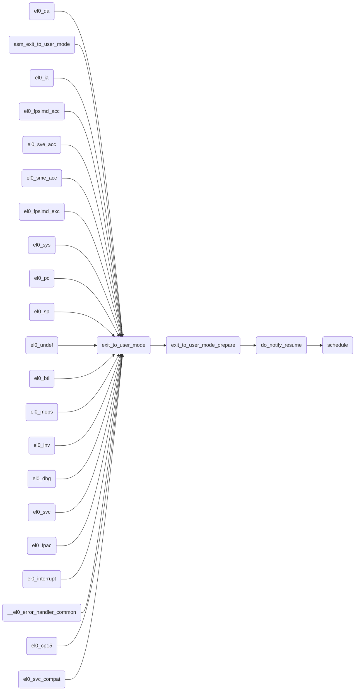
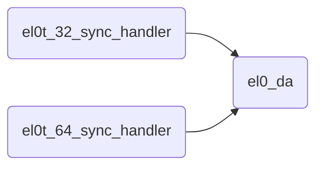
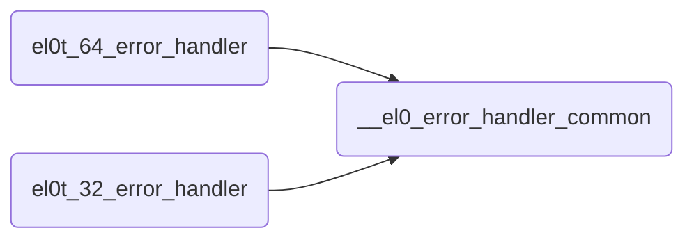

[TOC]

# 调度点

## 返回用户态

- 代码基线Linux 6.12-rc3
- 代码位于```arch/arm64/kernel/entry-common.c```文件中：



返回用户态，说明首先就是从用户态进入内核态，那么用户态怎么进入内核态呢？

### el0_da



要理解这段代码，首先要搞懂el0t的概念。可以参考[栈寄存器选择](https://github.com/bryan-sz/android/blob/main/kernel/%E6%A0%88%E5%AF%84%E5%AD%98%E5%99%A8%E9%80%89%E6%8B%A9.md)

el0t_32_sync_handler就是32位模式下发生的同步异常，而el0t_64_sync_handler就是64位模式下发生的同步异常，而el0_da就是同步异常里面的data abort。

#### 怎么判断el0_da

以el0t_64_sync_handler为例，首先读取ESR寄存器，ESR寄存器会标识发生的异常类型，如果是data abort，就调用el0_da函数。
```
asmlinkage void noinstr el0t_64_sync_handler(struct pt_regs *regs)
{
	unsigned long esr = read_sysreg(esr_el1);

	switch (ESR_ELx_EC(esr)) {
	case ESR_ELx_EC_SVC64:
		el0_svc(regs);
		break;
	case ESR_ELx_EC_DABT_LOW:
		el0_da(regs, esr);
		break;
......
}
```

同理，其他的异常类型，也都是如此，都要调用exit_to_user_mode返回用户态，最终在do_notify_resume函数中，通过检查`_TIF_NEED_RESCHED`标志位，确定是否要调用schedule函数进行切换。

### asm_exit_to_user_mode

asm_exit_to_user_mode函数比较特殊，可以看一下如下代码：
```
static __always_inline void exit_to_user_mode(struct pt_regs *regs)
{
	exit_to_user_mode_prepare(regs);
	mte_check_tfsr_exit();
	__exit_to_user_mode();
}

asmlinkage void noinstr asm_exit_to_user_mode(struct pt_regs *regs)
{
	exit_to_user_mode(regs);
}
```
asm_exit_to_user_mode直接就是exit_to_user_mode的wrapper包装，但是使用的是asmlinkage关键词，有了这个关键词指定强制通过栈传递参数，才能在汇编代码中进行调用。

可以看到，在`arch/arm64/kernel/entry.S`文件中，确实在ret_from_fork中调用了asm_exit_to_user_mode函数。
```
SYM_CODE_START(ret_from_fork)
	bl	schedule_tail
	cbz	x19, 1f				// not a kernel thread
	mov	x0, x20
	blr	x19
1:	get_current_task tsk
	mov	x0, sp
	bl	asm_exit_to_user_mode
	b	ret_to_user
SYM_CODE_END(ret_from_fork)
NOKPROBE(ret_from_fork)
```

### __el0_error_handler_common


同样，el0t_64_error_handler与el0t_32_error_handler也都是asmlinkage关键词修饰，说明用于汇编代码调用，但是目前还没有搜索到直接调用的地方。

### 场景总结
根据上面的函数调用总结
|函数|场景|
|-|-|
|el0_da|el0(用户态)下面产生的data abort|
|asm_exit_to_user_mode|给汇编代码调用，用于汇编代码中返回用户态，当前用于fork进程后返回|
|el0_ia|el0(用户态)下面产生的instruction abort|
|el0_fpsimd_acc|el0(用户态)下面产生的SIMD指令异常|
|el0_sve_acc|el0(用户态)下面产生的SVE(scalable vector extension)指令异常|
|el0_sme_acc|el0(用户态)下面产生的SVE(scalable matrix extension)指令异常|
|el0_fpsimd_exc|el0(用户态)下面产生的浮点指令异常|
|el0_sys|el0(用户态)下面产生的系统指令异常|
|el0_pc|el0(用户态)下面产生的PC指针非对齐异常|
|el0_sp|el0(用户态)下面产生的SP指针非对齐异常|
|el0_undef|el0(用户态)下面产生的未定义指令异常|
|el0_bti|el0(用户态)下面产生的分支指令(branch target instruction)目标地址异常|
|el0_mops|el0(用户态)下面产生的SError|
|el0_dbg|el0(用户态)下面产生的watchpoint/breakpoint等调试异常|
|el0_svc|el0(用户态)下面产生的svc指令异常，也就是系统调用|
|el0_fpac|FEAT_FPAC实现后，el0(用户态)下面产生的指针验证指令异常|
|el0_interrupt|el0(用户态)下面产生的中断|
|__el0_error_handler_common|el0(用户态)下面产生的error异常，在异常向量表中的error|
|el0_cp15|el0(用户态)下面产生的协处理器cp15访问异常|
|el0_svc_compat|el0(用户态)下面32位用户态应用程序的svc系统调用兼容|
|el0_inv|el0(用户态)下面产生未定义异常，所有不在上面的都走这个分支处理|