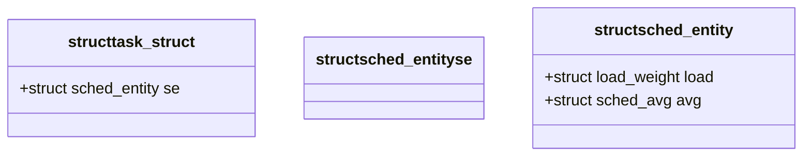

# 调度类定义
- 在kernel/sched/sched.h头文件中有DEFINE_SCHED_CLASS宏定义，用于简化内核中调度类的定义：
```
/*
 * Helper to define a sched_class instance; each one is placed in a separate
 * section which is ordered by the linker script:
 *
 *   include/asm-generic/vmlinux.lds.h
 *
 * *CAREFUL* they are laid out in *REVERSE* order!!!
 *
 * Also enforce alignment on the instance, not the type, to guarantee layout.
 */
#define DEFINE_SCHED_CLASS(name) \
const struct sched_class name##_sched_class \
	__aligned(__alignof__(struct sched_class)) \
	__section("__" #name "_sched_class")
```
- DEFINE_SCHED_CLASS宏会将传进来的name参数自动加上__sched_class作为调度类的名字；
- __aligned属性表明这些调度类在内存中的地址都是以sched_class对齐的；
- __section属性表明每个调度类都有一个独立的section,这个section在编译和连接生成vmlinux的时候用于内部布局;
- 以CFS为例，定义就是`DEFINE_SCHED_CLASS(fair)`，生成的名字就是fair_sched_class，最终位于__fair_sched_class这个section中；

# 内存布局
- 在include/asm-generic/vmlinux.lds.h文件中，有RO_DATA定义如下：
```
#define RO_DATA(align)							\
	. = ALIGN((align));						\
	.rodata           : AT(ADDR(.rodata) - LOAD_OFFSET) {		\
		__start_rodata = .;					\
		*(.rodata) *(.rodata.*) *(.data.rel.ro*)		\
		SCHED_DATA						\
		RO_AFTER_INIT_DATA	/* Read only after init */	\
		. = ALIGN(8);						\
		BOUNDED_SECTION_BY(__tracepoints_ptrs, ___tracepoints_ptrs) \
		*(__tracepoints_strings)/* Tracepoints: strings */	\
	}	
    ......
```
- 代表vmlinux中的只读段，其中包含了SCHED_DATA;
- 而SCHED_DATA的定义如下：
```
/*
 * The order of the sched class addresses are important, as they are
 * used to determine the order of the priority of each sched class in
 * relation to each other.
 */
#define SCHED_DATA				\
	STRUCT_ALIGN();				\
	__sched_class_highest = .;		\
	*(__stop_sched_class)			\
	*(__dl_sched_class)			\
	*(__rt_sched_class)			\
	*(__fair_sched_class)			\
	*(__ext_sched_class)			\
	*(__idle_sched_class)			\
	__sched_class_lowest = .;
```
- 这些带下划线的，就是上面DEFINE_SCHED_CLASS宏的section属性所制定的段，对应的调度类的数据就保存在这个位置；
- 因此，调度类都是只读的，不能动态增加或者删除调度类，也不能修改；
- 这里还有一个非常重要的点，就是这个顺序，决定了调度类的排序位置，用于运行期间判断调度类的优先级，具体后面再展开；

# 调度类视图


