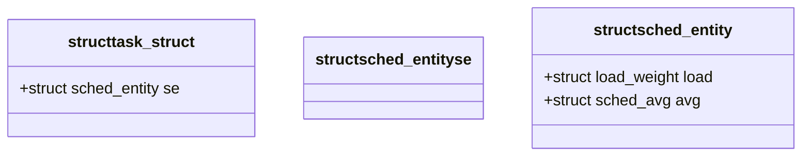

```mermaid
classDiagram
class struct task_struct
struct task_struct: +struct sched_entity se

class struct sched_entity se
struct sched_entity: +struct load_weight load
struct sched_entity: +struct sched_avg avg
```

