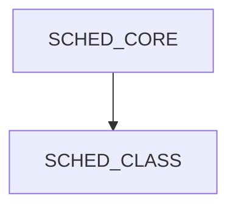
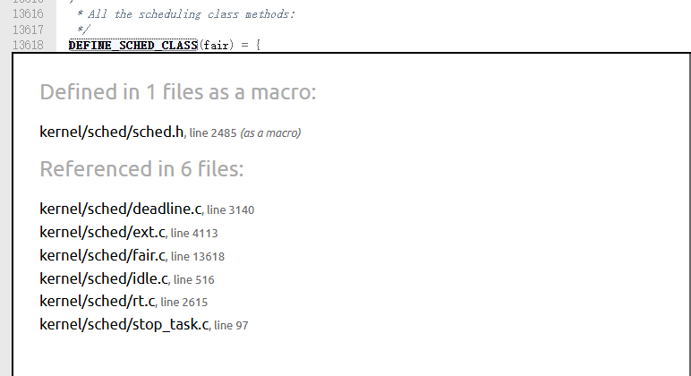
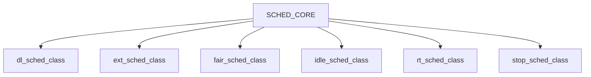

# Linux调度类解读
- 本文档以linux内核6.15-rc3作为源码基线。
- 在上一篇文章中，通过pick_next_task函数解读，已经看到了调用pick_next_task_fair回调函数，就涉及到了具体的调度类，具体来说，pick_next_task_fair就是CFS函数的pick函数实现。因此，本篇文章就先解读Linux的调度类，这样能够更好的理解后续的流程。

## 调度类分层
- `kernel/sched/core.c`文件中，是调度器的入口，内核其他模块需要进行调度时，调用的都是这个文件中定义的入口函数，比如最典型的就是`schedule`函数。
- 当我们看到pick_next_task_fair的具体实现时，就已经到了`kernel/sched/fair.c`文件中定义了，这就是通常我们所说的CFS（Complete Fair Scheduler，完全公平调度器）的具体实现了。CFS，我们就称之为一个调度类。
- 反过来说，一个好的设计，肯定是能够兼容多种不同的需求。而调度器正好是这一需求的最好反应，不同的任务有不同的需求。典型的比如：火箭点火控制，这个肯定是要求实时的，那必须有对应的试试调度类；同时多任务并行，那肯定都需要照顾，稍微晚一点也没有问题；而后台日志处理任务，晚上晚个一两个小时也没什么问题，那就肯定不需要特殊照顾。因此，就需要把调度器的入口和调度器的实现分离，进行解耦，我们才能通过多种调度类来支持多种不同的调度需求。
- 因此，我们可以简单的总结如下：


## 调度类数据结构
- 既然已经涉及了调度类分层的设计原理，那用什么数据结构来对调度类进行抽象呢？怎么定义各个调度类呢？
- Linux内核中对调度类进行抽象的数据结构是`struct sched_class`, 定义在`kernel/sched/sched.h`头文件第2364行，定义如下：
```
struct sched_class {
    ....
	void (*enqueue_task) (struct rq *rq, struct task_struct *p, int flags);
	bool (*dequeue_task) (struct rq *rq, struct task_struct *p, int flags);
	void (*yield_task)   (struct rq *rq);
	bool (*yield_to_task)(struct rq *rq, struct task_struct *p);

	void (*wakeup_preempt)(struct rq *rq, struct task_struct *p, int flags);

	int (*balance)(struct rq *rq, struct task_struct *prev, struct rq_flags *rf);
	struct task_struct *(*pick_task)(struct rq *rq);
	/*
	 * Optional! When implemented pick_next_task() should be equivalent to:
	 *
	 *   next = pick_task();
	 *   if (next) {
	 *       put_prev_task(prev);
	 *       set_next_task_first(next);
	 *   }
	 */
	struct task_struct *(*pick_next_task)(struct rq *rq, struct task_struct *prev);

	void (*put_prev_task)(struct rq *rq, struct task_struct *p, struct task_struct *next);
	void (*set_next_task)(struct rq *rq, struct task_struct *p, bool first);
    ....
};
```
- 这个调度类定义了很多如入队、出队、放弃CPU等回调函数钩子，这其实就是对应的调度器的入口函数的对应调度类需要实现的函数，里面就包含了前面文章中涉及的pick_next_task函数；

## 调度类定义
- 由于Linux内核调度类是核心数据结构，因此对于一个调度类的定义是有限制的，那么怎么保证每个调度类都是符合这个限制要求的呢？Linux内核在`kernel/sched/sched.h`文件第2485行定义了`DEFINE_SCHED_CLASS`这个辅助宏，保证符合相关限制要求。
```
/*
 * Helper to define a sched_class instance; each one is placed in a separate
 * section which is ordered by the linker script:
 *
 *   include/asm-generic/vmlinux.lds.h
 *
 * *CAREFUL* they are laid out in *REVERSE* order!!!
 *
 * Also enforce alignment on the instance, not the type, to guarantee layout.
 */
#define DEFINE_SCHED_CLASS(name) \
const struct sched_class name##_sched_class \
	__aligned(__alignof__(struct sched_class)) \
	__section("__" #name "_sched_class")

```
- 从这个宏定义可以看到，具体的就是需要按照结构体对齐，并放到对应的section中
  
## 详细调度类
- 全局搜索`DEFINE_SCHED_CLASS`引用，具体如下：

- 可以看到，在6个文件中分别进行了引用，这实际上也就对应了Linux内核中的6个调度类，分别是deadline，ext，fair（也就是通常所说的CFS），idle，rt和stop。分别如下：
```
DEFINE_SCHED_CLASS(dl)
DEFINE_SCHED_CLASS(ext)
DEFINE_SCHED_CLASS(fair)
DEFINE_SCHED_CLASS(idle)
DEFINE_SCHED_CLASS(rt)
DEFINE_SCHED_CLASS(stop)
```
因此，结合前面所说的调度类分层，准确的描述如下：

这六个调度类，严格遵循先后顺序：
`stop_sched_class > dl_sched_class(DEADLINE) > rt_sched_class(FIFO/RR) > ext_sched_class > fair_sched_class(CFS EEVDF) > idle_sched_class`
### stop_sched_class（停机调度类）｜最高优先级
- 无用户可配置策略，内核私有
- 用途：CPU 热插拔、进程迁移、stop_machine 内核临界操作
- 特性：可抢占所有其他任务，无任何任务能抢占它
### dl_sched_class（Deadline 限期调度类）｜硬实时
- 对应策略：SCHED_DEADLINE
- 算法：EDF 最早截止时间优先 + CBS 带宽隔离
- 场景：工业控制、音视频硬实时，严格保证周期 / 截止时间
### rt_sched_class（RT 实时调度类）｜软实时
- 对应策略：SCHED_FIFO、SCHED_RR
- 优先级区间：0~99（数值越小优先级越高）
- 场景：驱动线程、低延迟音频、实时业务服务
### ext_sched_class (扩展调度类) | eBPF自定义调度
- 对应策略：SCHED_EXT
- 能力说明：无固定静态优先级数值，调度逻辑完全由 eBPF 程序自定义，可自由实现业务分层优先级、大小核亲和、时延优先等调度规则
- 权限要求：加载 sched_ext 调度器需要 root 权限，仅普通公平类任务（SCHED_NORMAL/SCHED_BATCH）可交由该调度类管理，不干涉 DL/RT 实时任务
- 场景：异构大小核设备调度、AI 推理线程自适应调度、数据库低延迟调度、云租户负载隔离、业务定制化性能优化等场景
### fair_sched_class（CFS 完全公平调度类）｜普通用户进程
- 内部包含 3 种用户策略：
  - SCHED_NORMAL（SCHED_OTHER）：桌面 / 常规业务，nice -20~19
  - SCHED_BATCH：批量后台任务，降低交互抢占
  - SCHED_IDLE：极低权重后台，仅 CPU 空闲时运行
### idle_sched_class（CPU 空闲调度类）｜全局最低
- 无用户策略，仅每个 CPU 专属 swapper (0 号空闲线程)
- 仅当所有队列无就绪任务才运行，触发 CPU 节能休眠

## 总结
- 从调度器核心到实现的六个调度类，搭建起了内核调度器最核心的骨架；而我们所用的最多的，就是CFS调度类，也是最应该关注的点；
- sched_ext在内核6.12开始引入内核，主要是互联网大厂的推动，因为原生内核调度器绝对是核心中的核心，无法动态修改，这不能满足物联网大厂业务多变的特性，因此，互联网大厂积极推动，最终在6.12进入内核；
- 想说的是，sched_ext目前看起来应用前景很广，特别是结合当前的AI，可以说在各个领域都会有光明的未来，这一点，可以参考：[scx](https://github.com/sched-ext/scx)