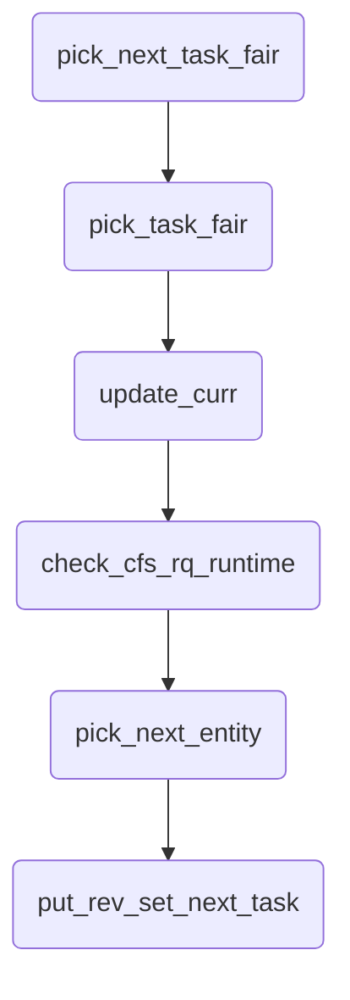
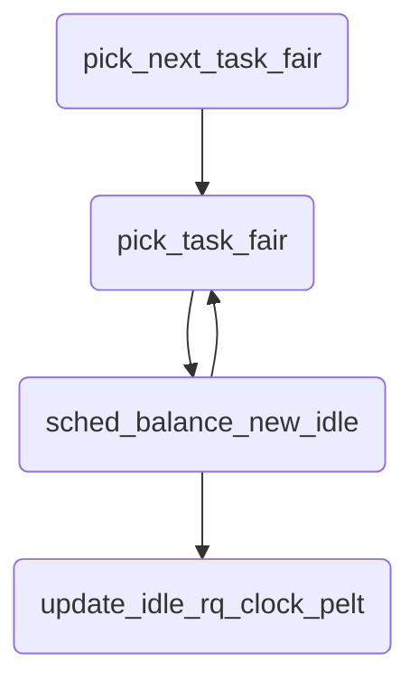

# 1. pick_next_task_fair函数解读
- 本文档以linux内核6.15-rc3作为源码基线。
- 在[pick_next_task函数解读](https://mp.weixin.qq.com/s/L6HCMv_EkbpmkTO3QIm1KA)中讲到快速路径会直接调用CFS调度类的pick_next_task_fair函数，就针对CFS调度类的pick_next_task_fair函数进行解读

## 1.1. 函数定义
- CFS调度类的实现都在kernel/sched/fair.c文件中，pick_next_task_fair函数就是在kernel/sched/fair.c文件第8873行，定义如下：
```
struct task_struct *
pick_next_task_fair(struct rq *rq, struct task_struct *prev, struct rq_flags *rf)
{
	struct sched_entity *se;
	struct task_struct *p;
	int new_tasks;

again:
	p = pick_task_fair(rq);
	if (!p)
		goto idle;
	se = &p->se;

#ifdef CONFIG_FAIR_GROUP_SCHED
	......
#endif
	put_prev_set_next_task(rq, prev, p);
	return p;

idle:
	if (!rf)
		return NULL;

	new_tasks = sched_balance_newidle(rq, rf);

	/*
	 * Because sched_balance_newidle() releases (and re-acquires) rq->lock, it is
	 * possible for any higher priority task to appear. In that case we
	 * must re-start the pick_next_entity() loop.
	 */
	if (new_tasks < 0)
		return RETRY_TASK;

	if (new_tasks > 0)
		goto again;

	/*
	 * rq is about to be idle, check if we need to update the
	 * lost_idle_time of clock_pelt
	 */
	update_idle_rq_clock_pelt(rq);

	return NULL;
}
```
- 为了保持精简，我们将CONFIG_FAIR_CGROUP_SCHED特性所定义的部分逻辑先省略，优先保持主流程的展开。
### 1.1.1. 选到合适的任务
- 首先，是如下几行核心代码：
```
again:
	p = pick_task_fair(rq);
	if (!p)
		goto idle;
	se = &p->se;
    put_prev_set_next_task(rq, prev, p);
	return p;
```
- 调用`pick_task_fair`，获取当前应当得到CPU运行的任务`p`，如果选出来的任务`p`为NULL，就说明当前没有任务需要运行，直接跳转到idle标记处，让CPU进入IDLE状态；
- 如果选到了任务`p`，获取线程对应的调度实体se；
- 调用`put_prev_set_next_task`函数，完成对应的切换旧任务+准备新任务的标准操作;
- 返回挑选出来的线程`p`;
#### 1.1.1.1. pick_task_fair
- 函数定义在kernel/sched/fair.c文件第8843行：
```
static struct task_struct *pick_task_fair(struct rq *rq)
{
	struct sched_entity *se;
	struct cfs_rq *cfs_rq;

again:
	cfs_rq = &rq->cfs;
	if (!cfs_rq->nr_queued)
		return NULL;

	do {
		/* Might not have done put_prev_entity() */
		if (cfs_rq->curr && cfs_rq->curr->on_rq)
			update_curr(cfs_rq);

		if (unlikely(check_cfs_rq_runtime(cfs_rq)))
			goto again;

		se = pick_next_entity(rq, cfs_rq);
		if (!se)
			goto again;
		cfs_rq = group_cfs_rq(se);
	} while (cfs_rq);

	return task_of(se);
}
```
- 首先获取rq对应的cfs_rq队列，如果`cfs_rq->nr_queued`为0，就说明队列中没有准备好的线程，直接返回NULL；
- 调用`update_curr`更新相关调度数据统计；
- 调用`pick_next_entity`挑选出来对应的调度实体；这个就是内核组织调度实体的红黑树里面挑选出来的，后续再专门展开；
- 需要说明的是，这里挑选到调度实体se后，又调用`group_cfs_rq`获取对应调度`se`的`cfs_rq`，并不断循环，直到选出来最后的调度实体se；这个就涉及到调度实体`se`不仅仅只是对应线程，还可能对应到组调度的多个实体组成的树状结构的根目录，因此需要遍历得到最后的`se`
- 最后调用`task_of`将获取到的调度实体`se`转换到对应的`task_struct`
#### 1.1.1.2. put_prev_set_next_task

### 1.1.2. 没有合适的任务
- 如果在pick_task_fair中没有宣导合适的任务时，会进入到idle标记的代码；
```
idle:
	if (!rf)
		return NULL;
```
- 首先是一个异常处理，如果rf标记为NULL，则说明没有任务需要选择，直接返回NULL；
- 接着调用`sched_balance_newidle`进行调度均衡，从其他rq队列中选择合适的任务；
  - 如果返回值小于0，则说明过程错误，返回`RETRY_TASK`，而`RETRY_TASK`定义在kernel/sched/sched.h:2354行，定义很简单：`RETRY_TASK		((void *)-1UL)`,就是将-1转换为void*类型指针，这样能够与函数的返回值类型struct *task_struct进行匹配；这也是linux kernel常用的一个编程小技巧，对于返回值是指针的函数，这样符合函数返回接口，同样也能表明这个是一个异常情况，需要调用函数进行对应的处理；
  - 如果返回值大于0，说明从其他的rq balance了任务过来到这个rq，那就跳转回到again标记处的pick_task_fair，重新挑选任务
  - 如果返回值等于0，说明没有从其他rq balance到任务，因此就主备进入IDLE状态，调用`update_idle_rq_clock_pelt`在CPU进行IDLE前更新相关统计；

## 1.2. 核心调用链
- pick_next_task_fair
  - pick_task_fair
    - update_curr
    - check_cfs_rq_runtime
    - pick_next_entity
  - put_prev_set_next_task
  - sched_balance_newidle
  - update_idle_rq_clock_pelt

## 1.3. 流程图
- 正常流程


- 进入balance流程


## 1.4. 总结
- pick_next_task_fair是CFS调度类对sched_core的pick_next_task的具体实现，也是从struct task_struct所表示的线程到CPU真正调度的调度实体sched_entity的转换。
- 总体上来说，pick_next_task_fair如果选到了合适的任务，就返回对应的任务；
- 如果没有选到合适的任务，就会尝试balance，并尝试拉取合适的任务过来运行
- 如果balance也没有成功，就直接返回NULL，让CPU准备进入IDLE状态。