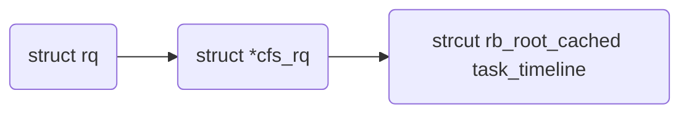

# 1. 引言
- 本文档以linux内核6.15-rc3作为源码基线。
- 在[CFS调度器设计](https://mp.weixin.qq.com/s/rfMeN8WvRgq2bKWIVcgpwQ)中讲到CFS/EEVDF调度器都使用红黑树，这篇文章就具体讲讲红黑树在内核EEVDF调度队列的具体使用情况。

# 2. 什么是红黑树
红黑树是Leonidas J. Guibas和Robert Sedgewick在《A Dichromatic Framework for Balanced Trees》论文中 提出的一篇改进的自平衡二叉查找树。红黑树的结构复杂，但它的操作有着良好的最坏情况运行时间，并且在实践中高效：它可以在 **${O(log⁡n)}$**  时间内完成查找、插入和删除，这里的n是树中元素的数目。

红黑树和AVL树一样都对插入时间、删除时间和查找时间提供了最好可能的最坏情况担保。这不只是使它们在时间敏感的应用，如实时应用中有价值，而且使它们有在提供最坏情况担保的其他数据结构中作为基础模板的价值；例如，在计算几何中使用的很多数据结构都可以基于红黑树实现。

红黑树在函数式编程中也特别有用，在这里它们是最常用的持久数据结构之一，它们用来构造关联数组和集合，每次插入、删除之后它们能保持为以前的版本。除了 **${O(log⁡n)}$**  的时间之外，红黑树的持久版本对每次插入或删除需要 **${O(log⁡n)}$**  的空间。

# 3. 红黑树性质
红黑树是每个节点都带有颜色属性的二叉查找树，颜色为红色或黑色。在二叉查找树强制一般要求以外，对于任何有效的红黑树增加了如下的额外要求：
- 节点是红色或黑色。
- 根是黑色。
- 所有叶子都是黑色（叶子是NIL节点）。
- 每个红色节点必须有两个黑色的子节点。（或者说从每个叶子到根的所有路径上不能有两个连续的红色节点。）（或者说不存在两个相邻的红色节点，相邻指两个节点是父子关系。）（或者说红色节点的父节点和子节点均是黑色的。）
- 从任一节点到其每个叶子的所有简单路径都包含相同数目的黑色节点。
下面是一个具体的红黑树的图例：

<p align="center">(此图片来自维基百科)</p>

其包含的各种操作的时间和空间复杂度如下：
|算法|平均|最差|
|-|-|-|
|搜索|**${O(log⁡n)}$**|**${O(log⁡n)}$** |
|插入|**${O(log⁡n)}$**|**${O(log⁡n)}$** |
|删除|**${O(log⁡n)}$**|**${O(log⁡n)}$** |
|空间|**${O(n)}$**|**${O(⁡n)}$** |

# 4. 内核中的红黑树源码
## 4.1. 内核源码文件介绍
内核中红黑树源码主要位于如下几个文件：
`linux/rbtree_types.h`
- 红黑树的基础数据类型的定义

`linux/rbtree.h`
- 红黑树的增删改查各种API

`lib/rbtree.c`
- 红黑树的红黑树的增删改查的具体实现

`linux/rbtree_augmented.h`
- 普通 rbtree 只维护排序 key；增强红黑树每个节点维护**以本节点为根的子树聚合元数据**（子树最大值、子树最大区间终点、gap 等）；在插入、删除、左旋右旋时通过回调自动维护这套子树信息，把区间查询、子树最值查询做到 O (log n)。

`linux/rbtree_latch.h`
- 闩锁式双副本红黑树，**双树副本 + seqcount_latch 顺序锁**，实现**无锁读，可在 NMI 上下文安全查询红黑树**；写端仍然需要自旋锁保护。Latch rbtree永远保证至少一棵树副本是完整稳定的；NMI 读直接访问稳定副本，不需要重试循环。

## 4.2. 基础数据结构
### 4.2.1. 节点
```
struct rb_node {
	unsigned long  __rb_parent_color;
	struct rb_node *rb_right;
	struct rb_node *rb_left;
} __attribute__((aligned(sizeof(long))));
/* The alignment might seem pointless, but allegedly CRIS needs it */
```
- 注释说明中，该对齐看起来毫无意义，但据说CRIS架构需要这个对齐约束。我也不知道这个CRIS具体是什么架构，是真的很老旧了吧。
- 这个结构体设计的很精妙，除了左右子节点的指针外，还有一个unsigned long的字段rb_parent_color。从这个命名看起来就很怪，又包含parent，又包含color。其实这个命名很准确，**把「父节点指针」和「本节点颜色」压缩到同一个 `unsigned long` 变量里，是经典位打包技巧**。
- `rb_node` 强制按 `sizeof(long)` 对齐，**rb_node 的起始地址一定是 4/8‑byte 对齐，地址最低 2 比特恒等于 0**。
父节点指针是 `struct rb_node*`，所以父指针的低两位也一定是 0。
于是：

- **bit0（最低位）：存储本节点颜色**
  - `0` → RB_RED 红色
  - `1` → RB_BLACK 黑色
- **高位比特：存放父节点指针**
- bit1 保留未使用，掩码用 `~3`（清除低 2 位）而不是 `~1`。 
⚠️注意：存的是**当前节点自己的颜色**，不是父节点的颜色。
```
// 获取父节点指针：清除低2bit
#define rb_parent(r)   ((struct rb_node *)((r)->__rb_parent_color & ~3))

// 获取本节点颜色，只看bit0
#define rb_color(r)    ((r)->__rb_parent_color & 1)
```

### 4.2.2. 根节点
```
struct rb_root {
	struct rb_node *rb_node;
};
```
- 根节点就是包含了rb_node的节点

### 4.2.3. rb_root_cached
```
/*
 * Leftmost-cached rbtrees.
 *
 * We do not cache the rightmost node based on footprint
 * size vs number of potential users that could benefit
 * from O(1) rb_last(). Just not worth it, users that want
 * this feature can always implement the logic explicitly.
 * Furthermore, users that want to cache both pointers may
 * find it a bit asymmetric, but that's ok.
 */
struct rb_root_cached {
	struct rb_root rb_root;
	struct rb_node *rb_leftmost;
};
```
- 注释说明了为什么缓存最左节点，而不缓存最右节点：权衡依据是：内存占用开销，对比能够受益于 O(1) rb_last() 的使用者数量。综合来看，增加最右缓存得不偿失。如果业务确实需要该能力，可以由使用者自己手动实现这套逻辑。另外，如果同时缓存左右两端指针，接口会出现一定的不对称性，但这不是大问题。
- 结合红黑树的特性，最左节点一定是中序遍历的最小节点，因此特别适合调度器查找最近快到期的节点，能够在O(1)的时间复杂度就选择出来。
  - CFS：直接取 `rb_leftmost` 就是 vruntime 最小任务
  - EEVDF：`rb_leftmost` 是 `deadline` 最小节点，但不一定 eligible，仍要做资格判断，不能直接调度。

## 4.3. 操作

| 接口 | 作用 |
| - | - |
|RB_ROOT|	初始化空树根|
|rb_init_node()	|初始化节点|
|rb_link_node()|	二叉搜索树定位，把节点挂入树|
|rb_insert_color()	|插入后做旋转、变色平衡修复|
|rb_erase(node, root)|	删除节点，自动平衡修复|
|rb_first(root)|	最小节点（一直向左）|
|rb_last(root)|	最大节点|
|rb_next(node)|	中序遍历下一个节点|
|rb_prev(node)|	中序遍历上一个节点|
|rb_insert_color_cached|	带 leftmost 缓存插入（CFS 用）|
|rb_erase_cached|	带缓存删除|

# 5. EEVDF运行队列中的红黑树
### 5.0.1. 数据结构

- 每一个CPU有一个运行队列rq
- 每个rq有一个CFS的运行队列cfs_rq
- 每一个cfs_rq中有一颗rb_root_cache类型的红黑树。注意，这里是只有红黑树的根节点和最左子节点。不过，能够根据根节点，完整索引整棵树，根据最左子节点，能够O(1)时间复杂度查找到最符合要求的调度实体。

# 6. 参考文档
- [Linux中的红黑树（rbtree）](https://www.kernel.org/doc/html/latest/translations/zh_CN/core-api/rbtree.html?f_link_type=f_linkinlinenote&flow_extra=eyJpbmxpbmVfZGlzcGxheV9wb3NpdGlvbiI6MCwiZG9jX3Bvc2l0aW9uIjowLCJkb2NfaWQiOiJjZjRlMGJkMTM0Zjg5Mjk4LTk1ZDdkODNmYWNlZmM3YWQifQ%3D%3D)
- [Trees II: red-black trees](https://lwn.net/Articles/184495/)
- [红黑树](https://zh.wikipedia.org/wiki/%E7%BA%A2%E9%BB%91%E6%A0%91)